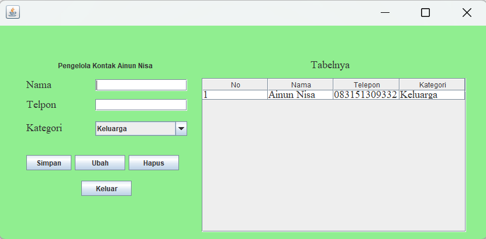

# AplikasiPengelolaKontak
 Ainun Nisa - 2210010099 - Latihan 3

# Aplikasi Pengelola Kontak
Aplikasi Pengelola Kontak adalah Aplikasi untuk mengelola kontak ke database SQLite

# Keunggulan Aplikasi
Pengelola Kontak: Aplikasi ini adalah untuk mengelola kontak keluarga, teman, kerja

# Pembuat Aplikasi
Ainun Nisa - 2210010099 - Latihan 3

# Fitur
Aplikasi ini menawarkan fitur:
Menambahkan Kontak serta mengedit dan menghapus

# Cara Menjalankan
Run File
Ketikkan Nama Yang Kita Input
Ketikkan Phone Yang Kita Input
Pilih kategori Yang Kita Input
Tekan Button Add maka akan muncul di panel ID, Name, Phone, dan category
Tekan Button Edit, jika ingin mengedit
Tekan Button Delete, jika Menghapus

# Demo
